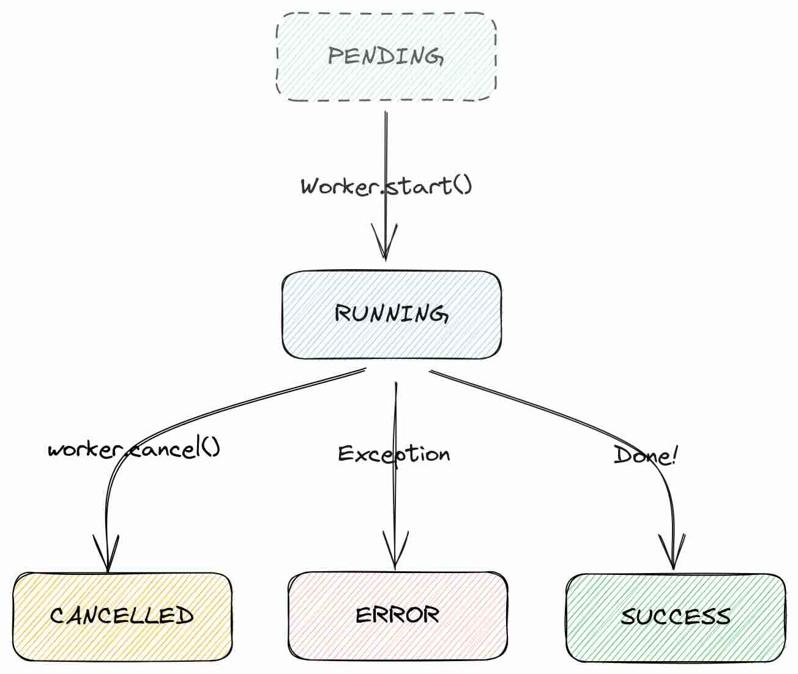

# Terminal User Interface

Pro inspiraci: https://github.com/rothgar/awesome-tuis

https://docs.python.org/3/library/curses.html - volitelná součást standardní knihovny Python
https://github.com/peterbrittain/asciimatics 
https://github.com/ceccopierangiolieugenio/pyTermTk
https://github.com/urwid/urwid
https://github.com/bczsalba/pytermgui - už zastarává, support myši

## Textual

Textual je popularni framework pro vytvareni UI v terminalu.
Je kompatibilni s textovou knihovnou [Rich](https://github.com/textualize/rich), diky niz umoznuje efektivne formatovat a barvit text.

Zdroje k Textual:
- https://textual.textualize.io/how-to/center-things/
- https://mathspp.com/blog/textual-for-beginners
- https://realpython.com/python-textual/

Awesome apps made in Textual:
- https://oleksis.github.io/awesome-textualize-projects/

### Instalace
Pozor, pro používání stačí nainstalovat textual, ale pro vývoj appek i textual-dev, takže instalujeme 2 package:
```
pip install textual textual-dev
```

### Demo

Jakmile máme nainstalováno, můžeme se pro inspiraci podívat na textual demo pomocí příkazu: `python -m textual`.

### Hello Textual!

```python
from textual.app import App
from textual.widgets import Static

class HelloTextualApp(App):
    def compose(self):
        yield Static("Hello, Textual!")

if __name__ == "__main__":
    app = HelloTextualApp()
    app.run()
```

### TCSS neboli Textual CSS

Textual používá vlastní omezenou podmnožinu CSS, takové pseudo CSS, skrze které nám ale umožňuje velmi jednoduše a srozumitelně stylovat widgety.

V příkladu níže přidáváme objektu static argument 'id', který odpovídá id v HTML, který poté můžeme v CSS označit skrze #id.
CSS pro jednoduchost načítáme přímo v HelloTextualApp() v proměnné CSS.

```python
from textual.app import App
from textual.widgets import Static

class HelloTextualApp(App):
  def compose(self):
    yield Static(
        "Hello, Textual!",
        id="hello" # objekt Static bude mit id=hello, pak v CSS stylujeme skrz #hello
        #classes="small blue" - muzeme take vytvaret tridy
        )
  
  CSS = """
  Screen {
    align: center middle;
  }

  #hello {
    background: blue 50%;
    border: wide white;
    width: auto;
  }
  """

if __name__ == "__main__":
  app = HelloTextualApp()
  app.run()
```

CSS můžeme také realizovat přes atribut .styles na jednotlivém widgetu.
V příkladu níže uložíme

```python
from textual.app import App
from textual.widgets import Label, Static

class SimpleApp(App):
  def compose(self):
    """Compose urcuje kompozici elementu v aplikaci.
    Pod povrchem je to generator, jednotlive widgety tedy "vracime" pres yield.
    """
    self.static = Static("I am a [bold red]Static[/bold red] widget!") # ukládáme referenci, abysme se k widgetu později dostali v on_mount
    yield self.static # widgety umistime skrze yield
    self.label = Label("I am a [yellow italic]Label[/yellow italic] widget!",)
    yield self.label

  def on_mount(self):
    """on_mount je volano po tom, co jsou widgety vytvoreny a umisteny,
    ale pred tim, nez je vykresleno... Nyni je idealni aplikovat styly.
    """
    # Stylovat nemusime jen pres CSS="", ale taky pres atribut .styles widgetu
    self.static.styles.background = "blue"
    self.static.styles.border = ("solid", "white")
    self.static.styles.text_align = "center"
    self.static.styles.padding = 1, 1
    self.static.styles.margin = 4, 4
    # Styling the label
    self.label.styles.background = "darkgreen"
    self.label.styles.border = ("double", "red")
    self.label.styles.padding = 1, 1
    self.label.styles.margin = 2, 4

if __name__ == "__main__":
  app = SimpleApp()
  app.run()
```

Styly ale můžeme také přidat v separátním souboru .tcss.
Výhodou tohoto řešení je, že můžeme naši aplikaci spustit v dev módu a vidět výsledky změn v .tcss file v reálném čase za běhu programu.
To nám hodně ulehčí život při psaní TCSS a stylování naší aplikace, protože ji nemusíme neustále restartovat.

Pro použití TCSS file stačí v třídě naší aplikace použít proměnnou CSS_PATH:

```python
class MyApp(App):
    CSS_PATH = "main.tcss" 
    # CSS_PATH = ["main.tcss", "another.tcss"] - muzeme taky pouzit seznam nekolika tcss souboru
    def compose(self):
        yield Header()
```

Pro live reloading TCSS potom musime spustit nasi aplikaci ne primo skrze `python main.py`, ale pres textual CLI:

```
textual run --dev main.py
```

### Textual Dev CLI

Pokud jsme nainstalovali krome modulu textual i textual-dev skrz `pip install textual-dev`, pak mame dostupny prikaz textual v prikazove radce.

Textual dev CLI nam mimo jine umoznuje interaktivne prozkoumat okraje, barvy, animace a eventy, viz help:

```
$> textual
Usage: textual [OPTIONS] COMMAND [ARGS]...

Options:
  --version  Show the version and exit.
  --help     Show this message and exit.

Commands:
  borders   Explore the border styles available in Textual.
  colors    Explore the design system.
  console   Run the Textual Devtools console.
  diagnose  Print information about the Textual environment.
  easing    Explore the animation easing functions available in Textual.
  keys      Show key events.
  run       Run a Textual app.
  serve     Run a local web server to serve the application.
```

`textual borders` - interaktivni prehled okraju
`textual colors` - prehled barev
`textual easing` - prehled animaci prechodu
`keys` - prehled eventu

#### Debugovaci console
S textual dev muzeme rozbehnout bocni consoli, v niz vidime debug toho, co se deje v nasi hlavni textual aplikaci:

1. v prvnim terminalu: `textual console`
2. v druhem terminalu spustit nasi aplikaci: `textual run --dev main.py`
3. appka se automaticky propoji s console a bude do ni posilat debug zpravy

#### Textual jako web stranka

textual CLI umoznuje take servovat nasi appku do prohlizece jako webovou stranku:

```
textual serve actions_bell.py
```
V prohlizeci pak otevreme http://localhost:8000.

### Compound Widget

Obcas muzeme chtit opakovat urcitou skupiny widgetu spolecne - napriklad label a pod nim input field.
Textual nam to umoznuje skrze tzv. Compound Widget, slozeny widget, nebo bysme taky mohliy rict group, skupinu widgetu.
Realizujeme jej jako nasi vlastni tridu, ktera dedi z obecne tridy textual.widgets.Widget.
V nasi nove tride muzeme pridat widgety, jak potrebujeme, upravit konstruktor `__init__()`, pridat defaultni CSS apod.:

```python
from textual.app import App
from textual.widget import Widget
from textual.widgets import Button, Header, Input, Label

class LabelledInput(Widget):
    """LabelledInput je nas custom Widget slozeny z nekolika jinych widgetu.
    V terminologii Textual je to Compound Widget, taky si to muzeme predstavit jako group.
    """
    DEFAULT_CSS = """
    LabelledInput {
        height: 4;
    }
    """
    def __init__(self, label):
        """Potrebujeme, aby nas widget prijimimal atribut label pri sve iniciaci.
        Takze overridujeme funkci __init__() a pridavame do ni parametr label.
        Ale to prinasi problem - tim prepiseme puvodni medotu Widget.__init__(),
        ktera na pozadi dela spoustu magie. Toto je casty problem pri dedeni z tridy
        a prepisovani __init__(). Reseni je ziskat rodicovskou tridu pres super()
        a na ni pak volat .__init__(). Nacez pokracujeme custom codem...
        """
        super().__init__() # funkce super() vraci rodice tj. tridu Widget. Na ni volame puvodni konstruktor __init__()
        self.label = label # a tady pokracujeme vlastnim kodem

    def compose(self):
        yield Label(f"{self.label}:")
        yield Input(placeholder=self.label.lower())


class MyApp(App):
    def compose(self):
        yield Header(show_clock=True, icon="👻")
        yield LabelledInput("Name")
        yield LabelledInput("Surname")
        yield LabelledInput("Email")
        yield Button("Click me!")

MyApp().run()
```

### Akce

Reakce na klavesy definujeme v promenne BINDINGS.
Jde o seznam tupples s 2 az 3 hodnotami:
1. tlacitko
2. nazev akce - ta pote automaticky vola metodu action_nazevAkce()
3. volitelne nazev akce ve footeru

```python
from textual.app import App
from textual.widgets import Footer, Label

class MyApp(App):
  BINDINGS = [
    ("b", "bell", "Ring"),
    ("q", "quit", "Get me out of here!!!")
    ]
  # "b" je tlacitko triggeruji action
  # "bell" je nazev action, automaticky vola funkci action_bell - action_ je apendovano implicitne!
  # "Ring" je nazev akce zobrazeny ve Footeru, bez nazvu by akce nebyla zobrazena ve footeru

  def compose(self):
    yield Footer()

  def action_bell(self):
    """Automaticky volano pri akci ring. Pozor predpona action_ je pridana automaticky, implicitne."""
    self.bell() # v klasickem terminalu by melo udelat zvuk...
    self.mount(Label("Ring!"))

  def action_quit(self):
    """Akce quit automaticky implicitne pocita s tim, ze bude volat funkci s nazvem 'action_'+'quit'
    neboli prave action_quit. """
    exit()

MyApp().run()
```

### Eventy

Vice v [events_buttons.py](./events_buttons.py).

### Workers

Někdy z aplikace potřebujeme spustit operaci, která zabere delší čas, například načítání dat z webu apod.
Po dobu této operace by ale naše UI bylo zablokováno a nereagovalo by na akce uživatelů, což by působilo nedobře jako lag/freeze.
Abychom se mohli takové situaci vyhnout, nabízí nám Textual tzv. workers API, které umožňuje volat kód asynchronně.

Metodu widgetu či Textual App můžeme pomocí dekorátoru `@work` z `from textual import work` změnit na neblokující metodu.
Například:

```python
from textual import work

@work(exclusive=True)    
async def update_weather(self, city: str) -> None:
  ...
```

alternativně také můžeme použít metodu `App.run_worker()` a zavolat tak metodu asynchronně jako workera:

```python
self.run_worker(self.update_weather(message.value), exclusive=True)
```

#### Weather.py - ukázkový program Workers API

Dostupný v [workers_weather.py](workers_weather.py).

#### detaily @work dekorátoru
 
Dekorátor @work ma nekolik parametru, ktere muzeme vyuzit pro lazeni jeho fungovani:

- name:str='' - A short string to identify the worker (in logs and debugging).
- group:str='default' - A short string to identify a group of workers.
- exit_on_error:bool=True - Exit the app if the worker raises an error. Set to False to suppress exceptions.
- exclusive:bool=False - Cancel all workers in the same group.
- description:str|None=None - Readable description of the worker for debugging purposes. By default, it uses a string representation of the decorated method and its arguments.
- thread:bool=False - Mark the method as a thread worker.

Plna dokumentace dekoratoru @work na: https://textual.textualize.io/api/work/

#### Stavy workera

Textual používá [několik stavů během života Workera](https://textual.textualize.io/api/worker/#textual.worker.WorkerState), ty jsou relativně intuitivní:
1. pending - worker čeká na vytvoření
2. running - worker byl spuštěn
3. cancelled - worker byl zrušen
4. error - worker skončil chybou
5. success - worker skončil správně

